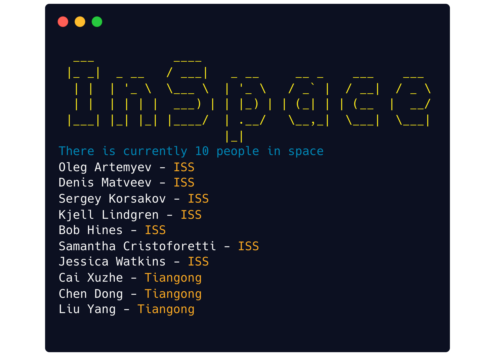

# Minimal Typescript based Command Line Interface (CLI) with Node.js

Our goal is to create a Node.js based Command Line Interface (CLI) using Typescript. This setup includes top-Level await support and ES module imports. 

## What We’re Going to Build

For this tutorial, we’re going to create a CLI called `inspace`.
When executed the CLI will output the current people in space.



## Getting Started

Create a new directory for the project. Call it whatever you want, I'm using `inspace`:
```shell
mkdir inspace
cd inspace
```

Setup a new npm package be creating a `package.json` file:
```shell
npm init -y
```

To support importing ES modules add the `type` property to the generated `package.json` file:
```json
{
  "type": "module",
  // rest...
}
```

To enable executing the CLI add the `bin` property to the generated `package.json` file:
```json
{
  "bin": "src/index.ts",
  // rest...
}
```

Create an `tsconfig.json` file in the same folder and include the following to enable importing ES modules and include top level await support:
```json
{
  "compilerOptions": {
    "target": "ES2022",
    "module": "ES2022",
    "esModuleInterop": true,
    "moduleResolution": "Node"
  }
}
```

## Creating the Entrypoint

Create the Typescript entrypoint `src/index.ts` file, to match the `package.json` bin property.
Include the following shebang as the first line of the file:
```typescript
#!/usr/bin/env npx ts-node --esm
```
The esm flag is include to support 
Ensure the file includes execution permission. Execution permission can be added using the following command:
```shell
chmod u+x ./src/index.ts
```

Add Typescript to the file to help test execution:
```typescript
console.log("Typescript executed successfully");
```

The file (CLI) can now be executed directly as if it was a binary.
```typescript
./src/index.ts
```

## Making the Command Available Globally

The npm package can now be locally installed globally using the following command:
```shell
npm install -g
```

After installation the npm package can now be executed using the package name:
```shell
inspace
```

## Package Dependencies

The foundation of the CLI has now been setup. The CLI's functionality is ready to be fleshed out and is supplemental to the CLI's foundation.
The following dependencies will be added only to showcase example CLI functionality.

- axios - promise based HTTP client
- chalk — colorizes the output
- clear — clears the terminal screen
- figlet — creates ASCII art from text


Install the dependencies using the following command:
```shell
npm install -S axios chalk clear figlet
```

## Example CLI Functionality

Add imports for the installed packages to the Typescript entrypoint `src/index.ts` file.
```typescript
import axios from 'axios';
import chalk from 'chalk';
import clear from 'clear'
import figlet from 'figlet'
```


We are using the Open Notify API as a data source. Create types to handle the API response.
```typescript
type People = {
  name: string;
  craft: string;
}

type Inhabitants = {
  number: number;
  people: People[]
}
```

Add a function to encapsulate interacting with the Open Notify API using Axios.
```typescript
async function getInhabitantsOfSpace() {
  const response = await axios.get<Inhabitants>("http://api.open-notify.org/astros.json");
  return response.data;
}
```

Clear the terminal screen using `clear`, then print a ASCII header using `figlet`.
```typescript
clear();
console.log(chalk.yellowBright(figlet.textSync('InSpace', { horizontalLayout: 'full' })));
```

Get the inhabitants of space using the `getInhabitantsOfSpace` function and print the results using `chalk`.
```typescript
const inhabitants = await getInhabitantsOfSpace();
console.log(chalk.blue(`There is currently ${inhabitants.number} people in space`));
inhabitants.people.forEach(person => console.log(`${person.name} - ${chalk.yellow(person.craft)}`));
```

## Publishing the CLI to NPM

The npm package can now be published if logged into npm using the following command:
```shell
npm publish
```

The npm package can now be installed globally using the following command:
```shell
npm install -g inspace
```

After installation the npm package can now be executed using the package name:
```shell
inspace
```


